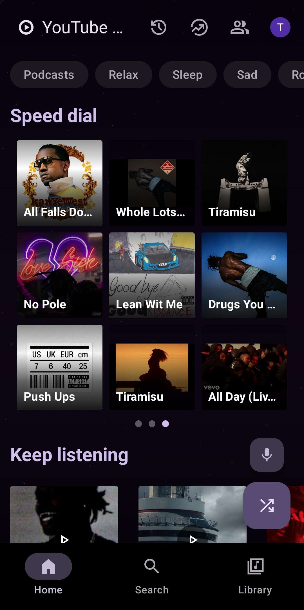
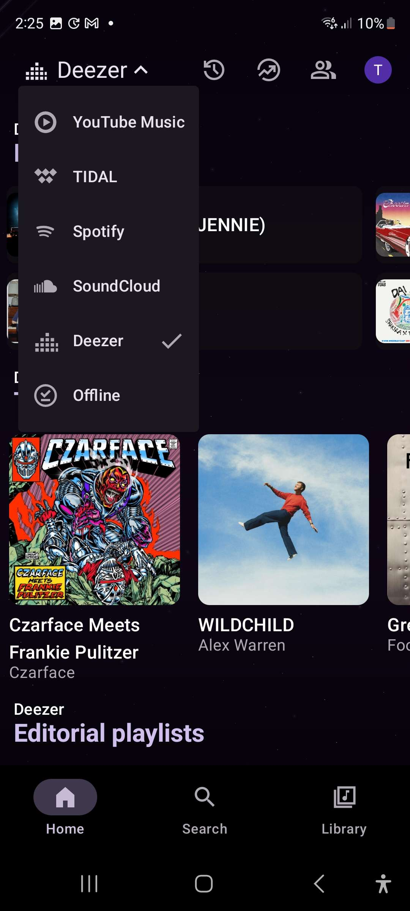
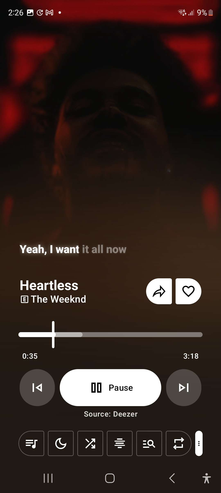
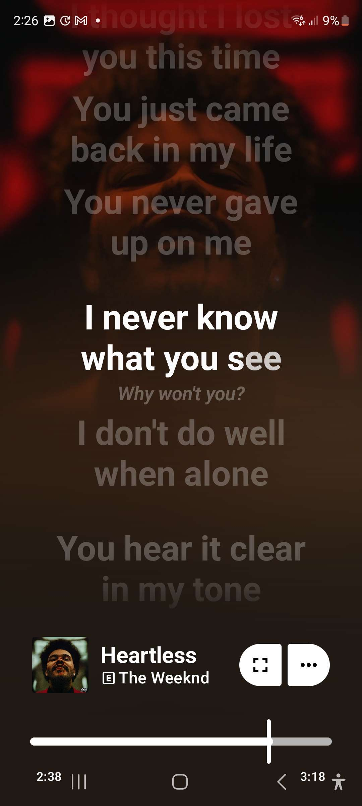

> [!NOTE]
> **Why this fork exists (and why your headset won't haunt you anymore)**
>
> MetroFuse is an unofficial fork of [Metrolist](https://github.com/MetrolistGroup/Metrolist).
>
> Among various streaming and provider tweaks, this fork includes a dedicated **External Input Control** master killswitch. Why? Because my headset developed a wonderful defect where it randomly fires phantom play/pause and track-skip signals at the worst possible moments.
>
> Rather than doing the rational thing and buying a new pair of headphones like a functioning member of society, I thought an entire Media3 session deactivation, `ForwardingPlayer` command lockdown, and keycode passthrough system to forcefully isolate the player from the hardware's ghostly tantrums would be easier. If your Bluetooth or wired gear is equally possessed, this toggle was made for you.
> else go to the official repo > [MetroFuse](https://github.com/956tris/MetroFuse).

## What Is MetroFuse?

MetroFuse is a fork of Metrolist focused on combining multiple music frontpages and playback providers in one Android app. It keeps the familiar Material 3 player, library, lyrics, queue, widgets, and playlist tools while adding source switching for different discovery and playback workflows.

The default playback path is Deezer-first, with other enabled providers used only when the primary source cannot produce a playable stream.
Im back :D
---

## Features

| Playback                               | Discovery                                            |
| -------------------------------------- | ---------------------------------------------------- |
| Qobuz-first playback routing           | YouTube Music home feed and many other frontends     |
| Provider fallback when a stream misses | Spotify-style personalized frontpage                 |
| Background playback                    | TIDAL-style personalized frontpage                   |
| Downloads and cache for offline use    | Search songs, albums, artists, videos, and playlists |
| Skip silence and sleep timer           | Open external playlists inside MetroFuse             |

| Audio                                                   | Library                                |
| ------------------------------------------------------- | -------------------------------------- |
| Format, bitrate, and sample-rate display when available | Full library management                |
| Audio normalization                                     | Local playlists                        |
| Tempo and pitch control                                 | Import playlists                       |
| Equalizer                                               | Reorder songs in playlist or queue     |
| Spotify Canvas support and animated album covers        | Lyrics, translation, and synced lyrics |

---

## Screenshots

<div align="center">







</div>

---

## Download

Grab the latest APK from the [GitHub releases page](releases/latest). Use a release build for normal installs; debug builds are only for local testing.

---

## Build

```bash
./gradlew :app:assembleFossDebug
```

Release builds require the project signing setup used by the maintainer.

---

## Credits

MetroFuse is built on top of Metrolist and stands on a pile of excellent open-source Android music work.

Special thanks to:

- [Metrolist](https://github.com/MetrolistGroup/Metrolist)
- [InnerTune](https://github.com/z-huang/InnerTune)
- [OuterTune](https://github.com/DD3Boh/OuterTune)

- [Better Lyrics](https://better-lyrics.boidu.dev)
- [MusicRecognizer](https://github.com/aleksey-saenko/MusicRecognizer)
- [Canvas Api](https://github.com/Paxsenix0/Spotify-Canvas-API)

## License

MetroFuse is licensed under GPL-3.0. See [LICENSE](LICENSE) for details.

---

## Disclaimer

MetroFuse is an independent, unofficial project. It is not affiliated with, funded, authorized, endorsed by, or associated with YouTube, Google, Qobuz, Spotify, TIDAL, Metrolist Group, or any of their affiliates.

All trademarks, service marks, catalogs, artwork, metadata, and content remain the property of their respective owners. Users are responsible for how they access third-party services and for following the rules, rights, and availability requirements of those services in their region.
